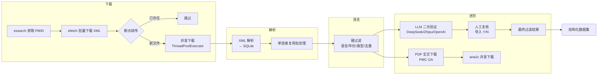

# 人类多组学文献批量下载与清洗系统

基于 NCBI E-utilities API，批量下载 PubMed 中人类多组学相关文献（聚焦 multi-omics 整合分析、且与人类/患者/临床相关），
经过解析、去重、质量过滤、LLM 二次验证，最终产出结构化数据集，
用于知识图谱构建或智能体效果评测。

## 特性

- **并发下载** — XML 批次下载自动并发（`ThreadPoolExecutor` + 全局速率限制器），充分发挥 NCBI API 配额
- **二级过滤** — 硬过滤（规则引擎）→ LLM 验证（多 Provider）
- **断点续传** — XML 批次自动跳过已下载文件；LLM 验证崩溃后可恢复；PDF 下载失败可 `--step pdf-retry` 续跑
- **多 Provider** — 支持 DeepSeek、智谱 GLM、OpenAI 兼容 API 三种 LLM 后端
- **智谱 Batch API** — 异步批量验证，支持中断恢复与自动降级同步模式重试
- **数据库复用连接** — 所有批处理操作复用单连接，减少连接开销

## 关于文献格式

PubMed E-utilities 下载的是 **XML 格式的元数据**（标题、摘要、关键词、MeSH词、作者等），
**不是 PDF**。这对后续分析已经足够，因为：
- 90% 的关键信息可从摘要中提取
- XML 结构化程度高，解析准确
- 不存在版权问题，可自由下载

如需全文，PMC 开放获取文章可通过 `--step pdf` 参数额外下载 PDF，失败后可 `--step pdf-retry` 续传。

## 搜索策略

`config/settings.py` 中的 `PUBMED_QUERY` 为默认搜索词，聚焦：
1. 明确提及 `multi-omics` / `multi omics`
2. 同时包含整合分析特征（integrated / integrative / combined / joint / multi-modal）
3. 且与人类相关（human / patient / clinical）

可用 `--query` 参数覆盖默认搜索词。

## 项目结构

```
pubmed-etl/
├── config/
│   ├── __init__.py
│   ├── settings.py              # 全局配置（API Key、路径、搜索词、LLM 配置等）
│   └── .env.example             # 环境变量模板（复制为 .env 后填入密钥）
├── downloader/
│   ├── __init__.py
│   ├── pubmed_downloader.py     # NCBI E-utilities 批量下载 XML（并发 + 速率限制 + 代理）
│   └── pdf_downloader.py        # PMC OA 全文下载（PDF/TGZ），失败导出清单 + checkpoint 断点续传
├── parser/
│   ├── __init__.py
│   └── xml_parser.py            # XML 解析 → SQLite（复用单连接写入）
├── cleaner/
│   ├── __init__.py
│   ├── hard_filter.py           # 硬过滤（语言/摘要/年份/类型/标题/去重）
│   └── llm_validator.py         # LLM 二次验证（支持 DeepSeek / Zhipu / OpenAI）
├── utils/
│   ├── __init__.py              # now_iso() 工具函数
│   ├── logger.py                # 统一日志
│   └── db.py                    # 数据库工具函数（含三张表）
├── data/
│   ├── raw_xml/                 # 原始 XML 文件
│   ├── processed/               # SQLite 数据库（multiomics_lit.db）
│   ├── output/                  # CSV 输出
│   └── pdfs/                    # LLM 判定相关文献的 PDF 全文（无 PDF 时 .txt）
├── logs/                        # 运行日志
├── tests/                       # 单元测试
├── main.py                      # 一键运行入口
├── requirements.txt
└── README.md
```

## 流水线架构



> **注意**：`--step all`（默认）仅执行 **下载 → 解析 → 清洗**（硬过滤）。
> LLM 验证、导入复核、PDF 下载为独立步骤，需通过对应 `--step` 参数单独执行。

## 快速开始

```bash
# 1. 安装依赖
pip install -r requirements.txt

# 2. 配置 API Key
#    复制 config/.env.example 为 config/.env，填入你的真实密钥
#    可选：设置 PROXY=http://127.0.0.1:7890 走代理访问 NCBI 等外网（留空直连）
#    .env 已加入 .gitignore，不会误提交

# 3. 运行核心流程（下载 → 解析 → 硬过滤）
python main.py

# 4. LLM 二次验证
#    通过 ETL_LLM_PROVIDER 环境变量切换供应商（deepseek / zhipu / openai），缺省回退 LLM_PROVIDER / zhipu
#    对应在 .env 中设置 DEEPSEEK_API_KEY / ZHIPU_API_KEY / OPENAI_API_KEY
python main.py --step validate

# 5. 导入人工复核结果（在导出的 CSV 中标注 Y/N 后）
python main.py --step import-review

# 5.1 导出复核通过文献的原始信息（不含 LLM 判断与人工复核列）
python main.py --step export

# 批量验证（智谱专用，异步处理大文献集）
python main.py --step validate --batch

# 6. 下载 OA 全文 PDF
python main.py --step pdf                     # 仅下载 OA 全文 PDF
python main.py --step pdf-retry               # 仅重试之前失败的下载（断点续传）
```

### 单步运行

```bash
# 仅下载 XML（支持断点续传，已存在的批次自动跳过）
python main.py --step download

# 仅解析 XML → SQLite（可指定 XML 目录）
python main.py --step parse
python main.py --step parse --xml-dir data/raw_xml

# 仅硬过滤
python main.py --step clean

# 下载 OA 全文 PDF
python main.py --step pdf

# 仅重试之前失败的 OA PDF 下载（断点续传，可中断后重复执行）
python main.py --step pdf-retry

# LLM 二次验证（同步模式 5 篇/批）
python main.py --step validate

# LLM 二次验证（智谱 Batch API 异步模式，每篇独立请求）
python main.py --step validate --batch

# 导入人工复核 CSV（自动查找最新复核文件）
python main.py --step import-review
# 指定复核文件
python main.py --step import-review --csv data/output/llm_review_pending_20250101_120000.csv

# 导出复核通过文献的原始信息 CSV（pmid/title/abstract 等全部原始字段，无 LLM/复核列）
python main.py --step export

# 自定义搜索词
python main.py --query "multi-omics AND human"
```

### 常用参数速查

| 参数 | 适用阶段 | 说明 |
|------|----------|------|
| `--step` | 全部 | 运行指定阶段（download / parse / clean / pdf / pdf-retry / validate / import-review / export / all） |
| `--batch` | validate | 使用智谱 Batch API 异步验证（仅 `LLM_PROVIDER=zhipu` 时生效，否则自动降级同步） |
| `--query` | download / all | 自定义 PubMed 搜索词 |
| `--xml-dir` | parse / all | XML 文件目录（默认 `data/raw_xml/`） |
| `--csv` | import-review | 人工复核 CSV 文件路径（默认自动查找最新文件） |

## 输出文件

| 文件 | 说明 |
|------|------|
| `data/processed/multiomics_lit.db` | 全量结构化文献库（articles + filter_log + llm_validation 三张表；batch 检查点存于 `data/output/llm_batch_progress.json`） |
| `data/output/llm_review_pending_*.csv` | LLM 验证待人工复核清单（标注 Y/N） |
| `data/output/llm_validation_failed_*.csv` | LLM 校验失败 PMID 清单 |
| `data/output/llm_filtered_*.csv` | LLM + 人工复核后的最终过滤结果 |
| `data/output/articles_raw_*.csv` | 复核通过文献的原始信息（不含 raw_xml_file、LLM/复核列） |
| `data/output/failed_downloads_*.csv` | PDF 下载失败链接清单（供 `--step pdf-retry` 续跑） |
| `data/output/pdf_download_progress.json` | PDF 重试断点（中断后自动恢复） |
| `data/output/oa_download_links_*.csv` | OA 资源下载链接清单 |
| `data/pdfs/` | LLM 判定相关文献的 PDF 全文文件（tgz 包内无 PDF 时回退保存 `.txt` 文本全文） |
| `logs/` | 各模块运行日志（按名称+日期分文件） |